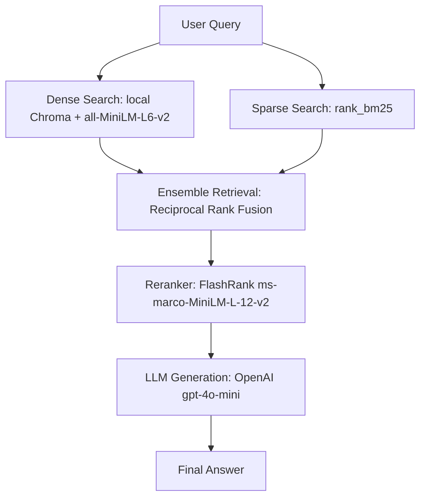

# Project 02: Hybrid Search RAG with Re-ranking (BM25 + Chroma + FlashRank + Gemini)

This project demonstrates **Hybrid Search Retrieval-Augmented Generation (RAG) with Re-ranking**. It showcases how to build a state-of-the-art, high-precision retrieval pipeline entirely locally before using a cloud LLM (Google Gemini) for the final response generation.

By combining dense and sparse search, and then narrowing them down using a Cross-Encoder Reranker, this pipeline delivers higher relevance, lower LLM token usage, and zero hosting costs for the database.

---

## 💡 Key Architectural Pillars



1. **Dense Retrieval (Semantic)**: Uses local **Chroma DB** and Hugging Face's `all-MiniLM-L6-v2` embeddings to search for conceptual similarity.
2. **Sparse Retrieval (Keyword)**: Uses **BM25** (`rank_bm25`) to match exact jargon, terms, and technical terms.
3. **Ensemble & Fusion**: Merges both dense and sparse candidate sets using Reciprocal Rank Fusion (RRF).
4. **Re-ranking (Precision)**: Takes the top candidate docs and scores them using **FlashRank** (a lightweight, super-fast Cross-Encoder). Only the highest scoring documents are sent to the LLM.
5. **Generation**: Uses **OpenAI gpt-4o-mini** to write the final response.

---

## 🛠️ Tech Stack
- **Orchestration**: [LangChain](https://github.com/langchain-ai/langchain)
- **Vector Database**: [Chroma](https://www.trychroma.com/) (Local)
- **Keyword Search**: BM25 (`rank_bm25`)
- **Embeddings (Dense)**: HuggingFace (`sentence-transformers/all-MiniLM-L6-v2`)
- **Reranker**: [FlashRank](https://github.com/PrithivirajDamodaran/FlashRank) (`ms-marco-MiniLM-L-12-v2`)
- **LLM (Generation)**: OpenAI gpt-4o-mini via `langchain-openai`

---

## 🚀 Setup & Execution

### 1. Configure API Key
Create a `.env` file in this folder (or copy from `.env.example`):
```bash
cp .env.example .env
```
Fill in your OpenAI API Key:
```env
OPENAI_API_KEY="your-openai-api-key"
```

### 2. Run the pipeline CLI
Make sure your virtual environment is active, and run the entry point dashboard:
```bash
python src/app.py
```

1. Select **Option 1** to ingest the sample documents (creates the Chroma DB and BM25 index locally).
2. Select **Option 2** to query the RAG pipeline. Observe how the source documents display their FlashRank relevance score!
